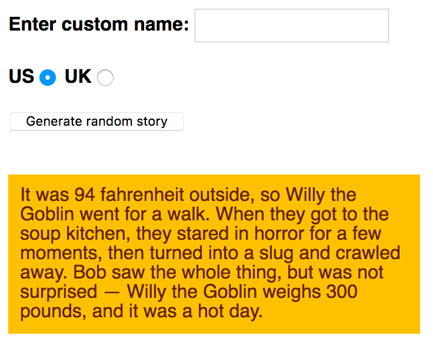

# Silly Story Generator

## Overview: JavaScript First Steps

In this assessment, you'll be tasked with taking some of the knowledge you've picked up in this module's articles and applying it to create a fun app that generates random silly stories. Have fun!

### Prerequisites

Before attempting this assessment, you should have already worked through all the articles in this module.

### Objective

To test comprehension of JavaScript fundamentals, such as variables, numbers, operators, strings, and arrays.

## Starting Point

To get this assessment started, you should:

- Go and grab the HTML file for the example, save a local copy of it as `index.html` in a new directory somewhere on your computer, and do the assessment locally to begin with. This also has the CSS to style the example contained within it.
- Go to the page containing the raw text and keep this open in a separate browser tab somewhere. You'll need it later.
- Alternatively, you could use an online editor such as CodePen, JSFiddle, or Glitch. You could paste the HTML, CSS, and JavaScript into one of these online editors. If the online editor you are using doesn't have a separate JavaScript panel, feel free to put it inline in a `<script>` element inside the HTML page.

> **Note:** If you get stuck, you can reach out to us in one of our communication channels.

## Project Brief

You have been provided with some raw HTML/CSS and a few text strings and JavaScript functions; you need to write the necessary JavaScript to turn this into a working program, which does the following:

- Generates a silly story when the "Generate random story" button is pressed.
- Replaces the default name "Bob" in the story with a custom name, only if a custom name is entered into the "Enter custom name" text field before the generate button is pressed.
- Converts the default US weight and temperature quantities and units in the story into UK equivalents if the UK radio button is checked before the generate button is pressed.
- Generates a new random silly story every time the button is pressed.

The following screenshot shows an example of what the finished program should output:

The silly story generator app consists of a text field, two radio buttons, and a button to generate a random story.

